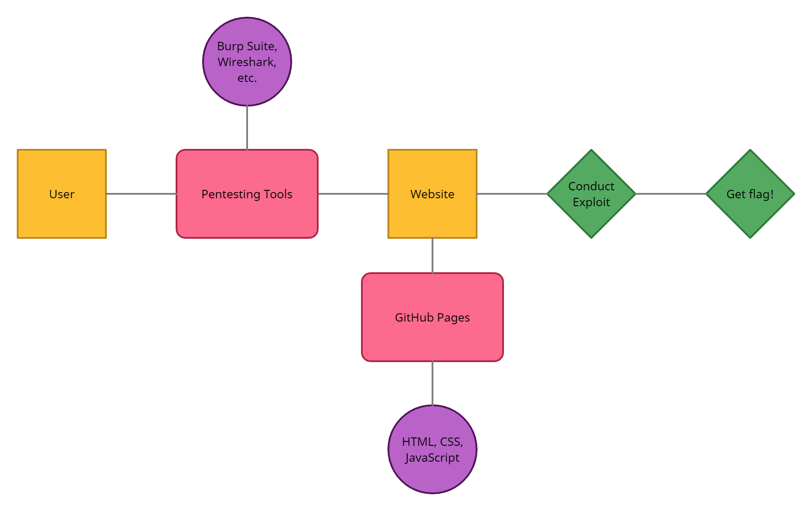

# Super Secure Login Page

We are making an interactive website that contains a login page with vulnerabilities to be exploited and secured. Our goal is to learn some web security and create an interesting project that shows our progress along the way! 

See our [Project Proposal](https://github.com/CS340-21/WebSecurity/blob/master/Project_Proposal.md) for more information.  
See our [Documentation](https://github.com/CS340-21/WebSecurity/wiki/Documentation) for our process.

  

## Group Members

* [Blake Childress](https://github.com/ObsidianSkin)
* [Jacob Leonard](https://github.com/jacobleonard545)
* [Alex Brock](https://github.com/ShrimpyJ)

  

